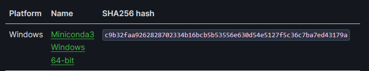

# Kurs Pythona

## Instalacja Pythona

Python jest rozwijany od ponad 30 lat, a w tym czasie pojawiło się wiele jego wersji. Obecnie korzystamy z najnowszej wersji, 3.11.5. Choć dokładna wersja może nie być kluczowa dla naszych potrzeb, ważne jest, aby wszyscy użytkownicy korzystali z Pythona serii 3.x, a nie z przestarzałej serii 2.x, ze względu na szereg istotnych zmian i ulepszeń wprowadzonych w serii 3.x, które nie są kompatybilne wstecz.

Dla ułatwienia instalacji i zapewnienia spójności środowiska pracy, zalecamy instalację Pythona poprzez pakiet dystrybucyjny Anaconda. Anaconda to popularna dystrybucja Pythona, skierowana głównie do nauki, inżynierii, analizy danych i obliczeń naukowych. Oferuje zarówno interpreter Pythona, jak i bogaty zestaw preinstalowanych bibliotek naukowych i analitycznych, co ułatwia zarządzanie pakietami i środowiskami pracy.

Anaconda jest dostępna do pobrania w formie Miniconda, lżejszej wersji dystrybucji, zawierającej podstawowe komponenty i menedżera pakietów conda, co umożliwia elastyczne dostosowanie środowiska do własnych potrzeb.

https://docs.anaconda.com/free/miniconda/index.html

Minconda 3 na Windows.

Instalacja Anacondy odbywa się w prosty sposób, podobnie jak instalacja innych programów. Oficjalna strona dokumentacji Anaconda zawiera szczegółowe instrukcje instalacji dla różnych systemów operacyjnych.

## Konfiguracja środowiska programistycznego - Visual Studio Code

Visual Studio Code (VSCode) to wszechstronny i lekki edytor kodu, który wspiera rozwój aplikacji w Pythonie poprzez zintegrowane narzędzia do debugowania, autouzupełniania kodu (IntelliSense), zarządzania wersjami z Git i inne. Jest to edytor rekomendowany dla programistów Pythona na każdym poziomie zaawansowania.

Aby zainstalować VSCode, odwiedź oficjalną stronę [Visual Studio Code](https://code.visualstudio.com/) i pobierz wersję odpowiednią dla Twojego systemu operacyjnego (Windows, Linux, macOS). Proces instalacji jest prosty i intuicyjny, jednak ważne jest, aby podczas instalacji zaznaczyć opcję "Add to PATH" (dodaj do zmiennej środowiskowej PATH) oraz "Add to context menu" (dodaj do menu kontekstowego). Opcja "Add to context menu" umożliwia otwieranie folderów w VSCode bezpośrednio z menu kontekstowego prawego przycisku myszy, co znacznie ułatwia dostęp do projektów.

Po zainstalowaniu VSCode, zalecane jest zainstalowanie rozszerzenia Python, które dostarcza wsparcie dla języka Python, w tym debugowanie, zarządzanie wymaganiami, uruchamianie testów jednostkowych oraz inne przydatne funkcje. Rozszerzenie to można znaleźć w marketplace VSCode, wyszukując "Python" w zakładce rozszerzeń (Extensions).

Pamiętaj, aby regularnie aktualizować VSCode oraz zainstalowane rozszerzenia, aby korzystać z najnowszych funkcji i poprawek bezpieczeństwa.

## Materiały wstępne

W repozytorium znajduje się krótki kurs uzupełniający do programowania w języku Python, obejmujący następujące tematy:

- [Zmienne](https://github.com/kkingstoun/Kurs-Pythona/blob/main/lecture_notes/zmienne.md)
- [Testowanie](https://github.com/kkingstoun/Kurs-Pythona/blob/main/lecture_notes/testowanie.md)
- [Funkcje](https://github.com/kkingstoun/Kurs-Pythona/blob/main/lecture_notes/funkcje.md)
- [Funkcje wbudowane](https://github.com/kkingstoun/Kurs-Pythona/blob/main/lecture_notes/funkcje_wbudowane.md)
- [Instrukcje sterujące](https://github.com/kkingstoun/Kurs-Pythona/blob/main/lecture_notes/instrukcje_sterujace.md)
- [Listy i krotki](https://github.com/kkingstoun/Kurs-Pythona/blob/main/lecture_notes/listy_i_krotki.md)
- [Zbiory i słowniki](https://github.com/kkingstoun/Kurs-Pythona/blob/main/lecture_notes/zbiory_i_slowniki.md)
- [Operacje na plikach](https://github.com/kkingstoun/Kurs-Pythona/blob/main/lecture_notes/operacje_na_plikach.md)

Przy większości z lekcji, na końcu, znajdują się zadania do samodzielnego rozwiązania, podzielone na dwie grupy: podstawowe i dodatkowe, gdzie te drugie są dla osób dysponujących większą ilością czasu.

## Materiały dodatkowe

Powstało mnóstwo książek oraz materiałów online uczących Pythona. Warte polecenia to z pewnością:

- [Zanurkuj w Pythonie](https://pl.wikibooks.org/wiki/Zanurkuj_w_Pythonie) - darmowa, w języku polskim.
- [Python Data Science Handbook](https://jakevdp.github.io/PythonDataScienceHandbook/index.html) - dostępna na otwartej licencji, porusza bardziej specjalistyczne tematy wykorzystywane w nauce.
- [Fluent Python, Clear, Concise, and Effective Programming](http://shop.oreilly.com/product/0636920032519.do) - dostęp płatny, ale to świetna pozycja dla bardziej zaawansowanych, tłumacząca wiele mechanizmów w Pythonie.
- Dokumentacja zarówno biblioteki standardowej, jak i najpopularniejszych bibliotek, z których będziemy korzystać, jest niezastąpionym źródłem wiedzy, napisanym przystępnym językiem i ilustrowanym wieloma przykładami.

## Sylabusy:

- [Akustyka] https://sylabus.amu.edu.pl/pl/document/9185f372-7b5e-4b0a-a05f-1cd3ef5b33f1.pdf
- [Fizyka Medyczna / Biofizyka] https://sylabus.amu.edu.pl/pl/document/22bf1bb8-caa0-4e16-9cfd-8d8ac64cc2f0.pdf

## Warunki zaliczenia zajęć:

### Ćwiczenia w salach komputerowych

Podstawę zaliczenia zajęć stanowi samodzielne rozwiązanie zadań problemowych na kolokwium zaliczeniowym. Warunkiem zaliczenia zajęć jest uzyskanie co najmniej 50% całkowitej liczby punktów możliwych do zdobycia na kolokwium.

### Kryteria oceny kolokwium:

- **bardzo dobry (bdb; 5,0):** wynik punktowy w zakresie 90-100% maksymalnej liczby punktów
- **dobry plus (+db; 4,5):** wynik punktowy w zakresie 80-89% maksymalnej liczby punktów
- **dobry (db; 4,0):** wynik punktowy w zakresie 70-79% maksymalnej liczby punktów
- **dostateczny plus (+dst; 3,5):** wynik punktowy w zakresie 60-69% maksymalnej liczby punktów
- **dostateczny (dst; 3,0):** wynik punktowy w zakresie 50-59% maksymalnej liczby punktów
- **niedostateczny (ndst; 2,0):** wynik punktowy poniżej 50% maksymalnej liczby punktów

## Źródło:

Kurs powstał na podstawie repozytorium stworzonego przez Łukasza Hryniuka, Szymona Mieszczaka i Mateusza Zelenta. Pierwotne repozytorium: (https://gitlab.com/lhryniuk/python).
